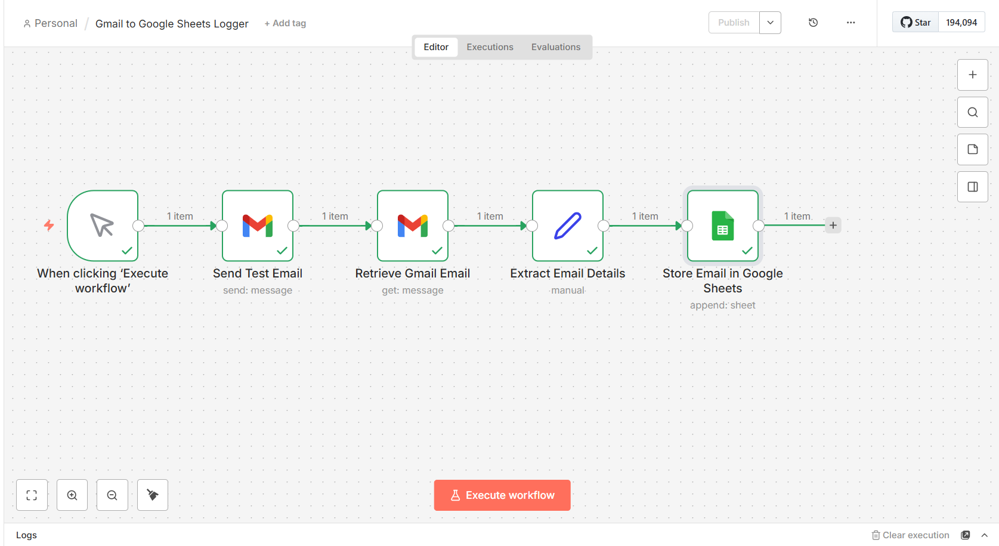
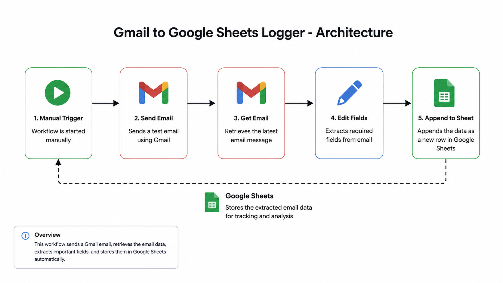
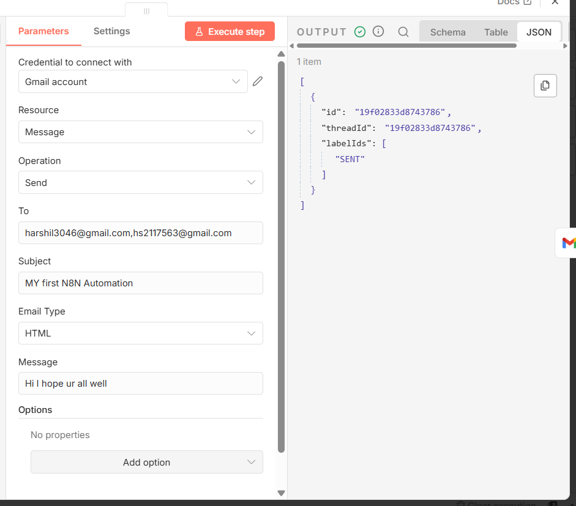
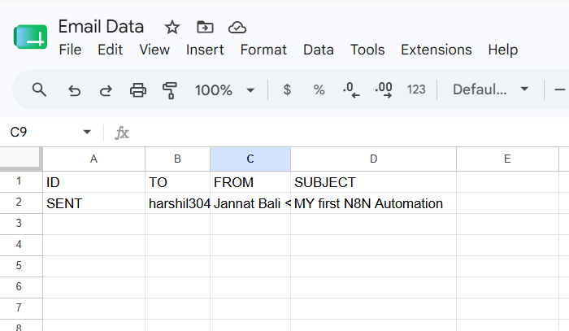

#  Gmail to Google Sheets Logger

A beginner-friendly **n8n automation** that retrieves Gmail email details and automatically logs them into a Google Sheet.

---

##  Overview

This workflow demonstrates how to connect Gmail with Google Sheets using n8n. It retrieves an email, extracts the required information, and appends it as a new row in a spreadsheet.

This project was built as part of my journey learning workflow automation with n8n.

---

##  Features

- Send a test email using Gmail
- Retrieve the latest email
- Extract required email fields
- Automatically append data to Google Sheets
- Beginner-friendly and easy to understand

---

##  Workflow

```text
Manual Trigger
      │
      ▼
Send Test Email
      │
      ▼
Retrieve Gmail Email
      │
      ▼
Extract Email Details
      │
      ▼
Store Data in Google Sheets
```

---

##  Workflow Screenshot



---

## 🏛️ Architecture



---

## 📊 Sample Output

### Gmail



### Google Sheets



---

## 🛠️ Tech Stack

- n8n
- Gmail API
- Google Sheets API

---

## 📂 Files Included

| File | Description |
|------|-------------|
| `workflow.json` | Exported n8n workflow |
| `workflow.png` | Workflow screenshot |
| `architecture.png` | Simple architecture diagram |
| `gmail-output.png` | Gmail output example |
| `google-sheet-output.png` | Google Sheets output example |
| `demo.mp4` | Short workflow demonstration |

---

## ▶️ How to Use

1. Download `workflow.json`.
2. Import it into your n8n instance.
3. Configure your Gmail credentials.
4. Configure your Google Sheets credentials.
5. Execute the workflow.
6. Verify that the email data is added to your Google Sheet.

---

## 🎯 Learning Outcomes

Through this project, I learned:

- Workflow automation using n8n
- Gmail integration
- Google Sheets integration
- Data transformation with Edit Fields
- Passing data between workflow nodes

---

## 🔮 Future Improvements

- Gmail Trigger instead of Manual Trigger
- Error handling
- Duplicate email detection
- Logging execution status
- AI-based email categorization

---

## 👩‍💻 Author

**Jannat Bali**

Learning n8n by building real-world automation projects.

⭐ If you found this project helpful, consider starring the repository!
